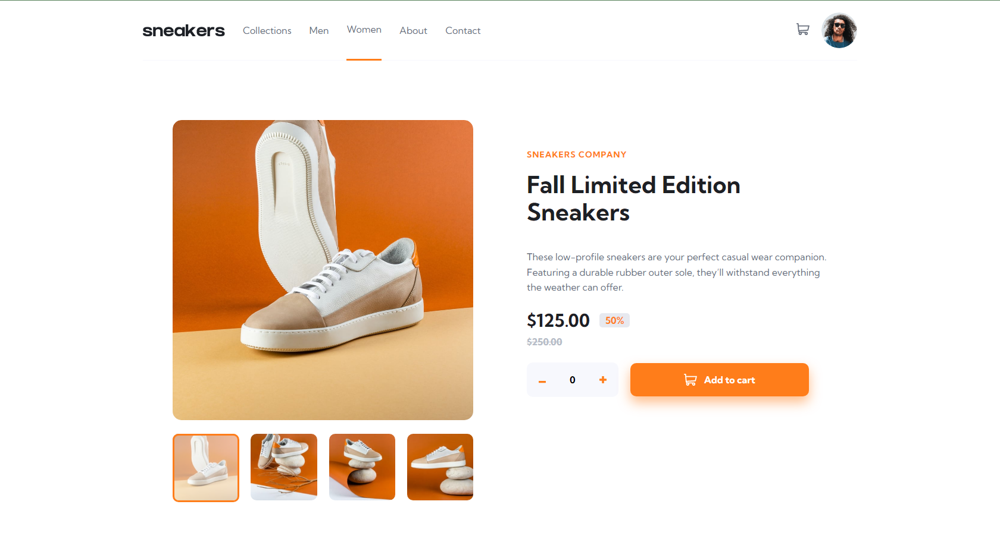
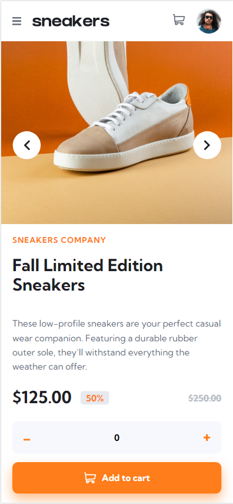
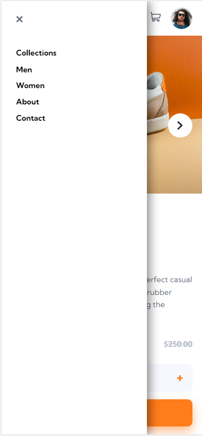

# Frontend Mentor - E-commerce product page

## Table of contents

- [Overview](#overview)
  - [The challenge](#the-challenge)
  - [Description](#description)
  - [Screenshot](#screenshot)
  - [Links](#links)
- [My process](#my-process)
  - [Built with](#built-with)
  - [Continued development](#continued-development)
  - [Useful resources](#useful-resources)
- [Author](#author)

## Overview

### The challenge

Users should be able to:

- View the optimal layout for the site depending on their device's screen size
- See hover states for all interactive elements on the page
- Open a lightbox gallery by clicking on the large product image
- Switch the large product image by clicking on the small thumbnail images
- Add items to the cart
- View the cart and remove items from it

### Description
- This is an e-commerce product page. render a product in different shapes for view the user can swap between images by clicking on the thumbnails below the image in display mode 
- The user can add any number of items to buy and then click on the "Add to cart" button a sample of the product gets displayed in the cart with the number of bought items and he can easily remove it from the cart 
- When the user clicks on the image in the display mode it pop-up on the screen and get the ability to swap between them by buttons with a fade animation and he also can click on the thumbnails to render the chosen one 
- On the mobile screen, the user can find a smooth slider between images and a menu icon on the top left corner
- The site is completely responsive for all screen sizes

### Screenshot

### Links

- Solution URL: [Go To Solution Page On Front-End Mentor]()
- Live Site URL: [Live Site On Github]()

## My process

### Built with

- Semantic HTML5 markup
- CSS3
- Flexbox
- CSS Grid
- Vanilla JavaScript

### Continued development

I tend to learn Design patterns while developing my technical skills in REACTjs 

- ### Useful resources
  - Arabic 2021
    - [HTML-Course](https://www.youtube.com/watch?v=6QAELgirvjs&list=PLDoPjvoNmBAw_t_XWUFbBX-c9MafPk9ji)
    - [CSS-Course](https://www.youtube.com/watch?v=X1ulCwyhCVM&list=PLDoPjvoNmBAzjsz06gkzlSrlev53MGIKe)
    - [JS-Course](https://www.youtube.com/watch?v=GM6dQBmc-Xg&list=PLDoPjvoNmBAx3kiplQR_oeDqLDBUDYwVv)

## Author

- [LinkedIn Profile](https://www.linkedin.com/feed/)
- [Frontend Mentor Profile](https://www.frontendmentor.io/home)